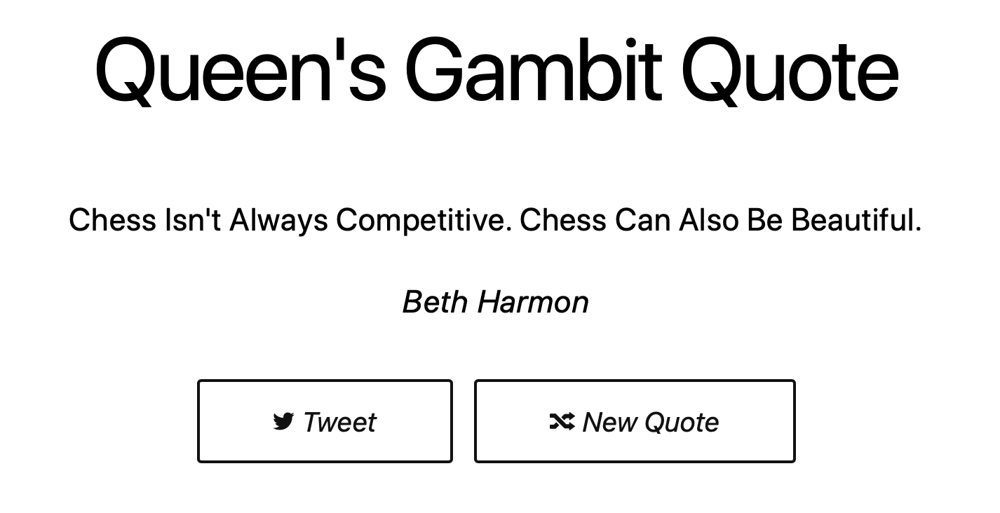

# Queen's Gambit Quotes


## Screenshot



## Stack

**Built with:**

- [Clojurescript](https://clojurescript.org/)
- [Reagent](https://reagent-project.github.io/) (React Wrapper for Clojurescript)
- [node](https://nodejs.org/)
- [shadow-cljs](http://shadow-cljs.org/) (Clojurescript Compiler)
- [Wing CSS](https://kbrsh.github.io/wing/)
- [Foundation Icons](https://zurb.com/playground/foundation-icon-fonts-3)

## Credits

- [sophiabrandt](https://github.com/sophiabrandt/breaking-bad-quotes)

## [Demo](http://demo.stindrago.com/the-queens-gambit)

## Run

``` shell
npm run deps # install dependencies

npm run watch # try it yourself
```

## Edit

If you want to add more quotes edit [src/queens_gambit_quotes/quotes.cljs](src/queens_gambit_quotes/quotes.cljs) file.
